# project_parkingAPP 智慧停車場預約系統APP #
## :heart:系統介紹 ##
 
With the advancement of technology, mobile devices and mobile networks are popularized in the society, and the information available makes life more convenient.
 
The public can make reservations in advance to know the location of the parking lot and get the nearby parking lot information from the application. To integrate the system by Google Cloud Firebase, when the vehicle reservation is completed, the license plate recognition system can control the problem of unable to enter the parking lot from the reservation,
reducingthe parking trouble in popular attractions and suburbs.
 
Our system uses the mobile phone to reserve a parking space online, upload the basic information and license plate number filled in by each owner to the cloud database in the application, and you can enter the parking lot directly after the reservation is completed. Before picking up the car, the owner only needs to check the "Payment Settings" in the application to see if the wallet is sufficient to pay for the parking fee, without waiting in line to leave the car,
and enjoy the convenience brought by this system to everyone.
## :dart:系統架構圖 ##

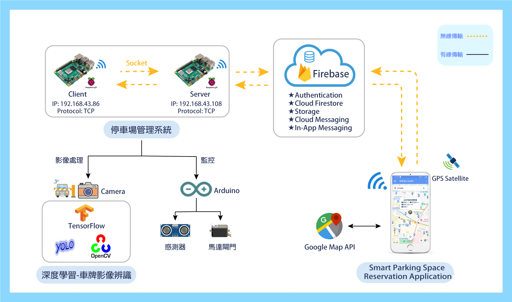

## :dart:Navigation Drawer 側選單 列表 ##

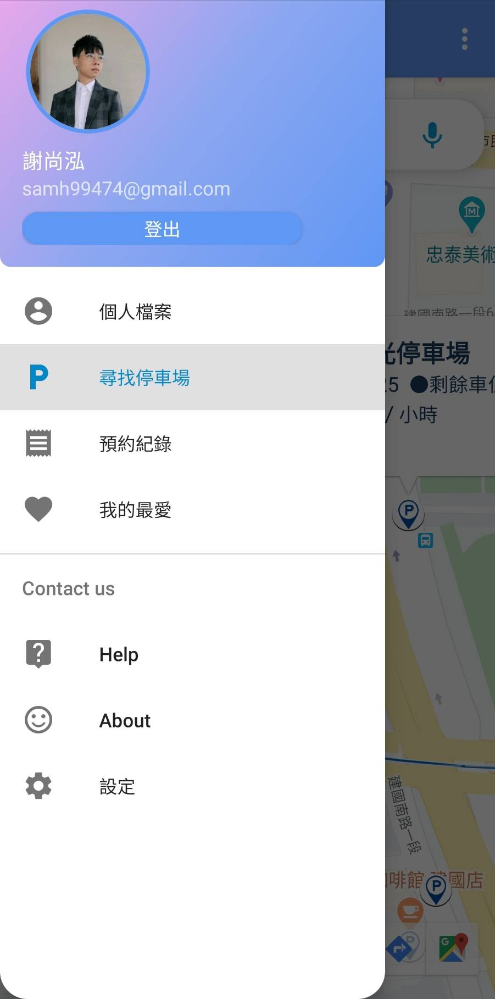

 :dart:1.側選單上方(簡易個人資料)
----------------------------
 
(1)大頭貼: 由使用者個人資料上傳於Firestorage，抓取下來
   (2)姓名、Email: 使用者個人資料編輯的姓名及註冊email
   (3)登入/登出: 使用者登入或登出

 :dart:2.個人檔案:
---------------------------
 
使用者登入後，即可進行查看個人資料以及編輯個人資料(大頭貼、姓名、連絡電話、車牌)，
我們使用Firebase提供的後端服務包含即時資料庫（Realtime database）、簡單的身分驗證模組（Authentication）、檔案儲存（Storage）。
 

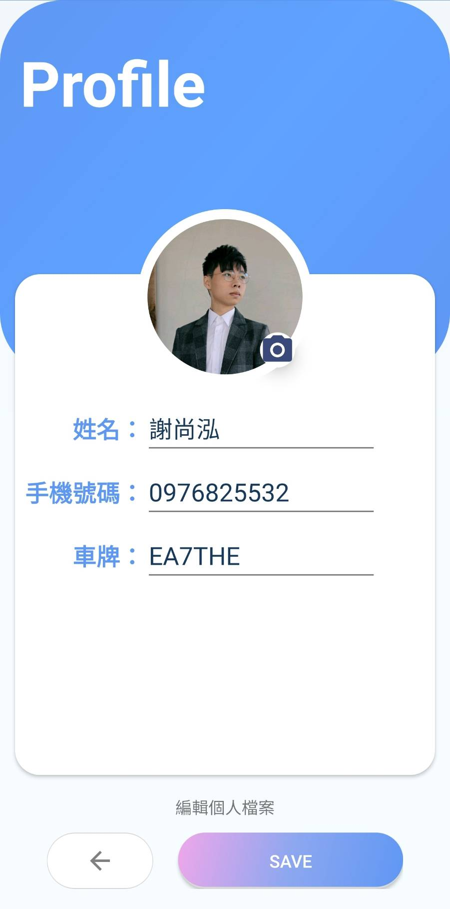
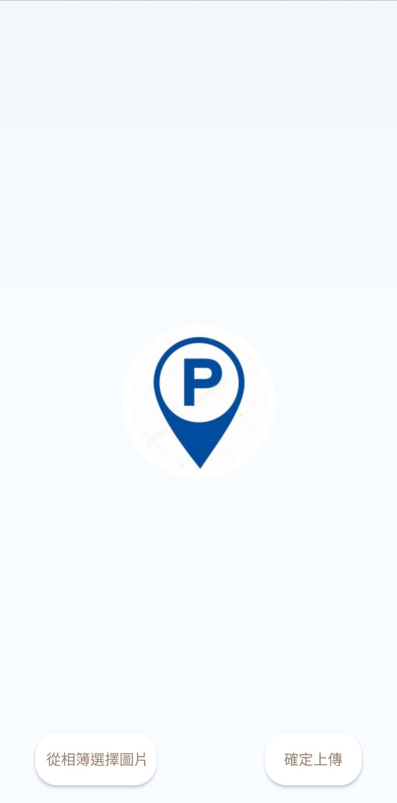

 
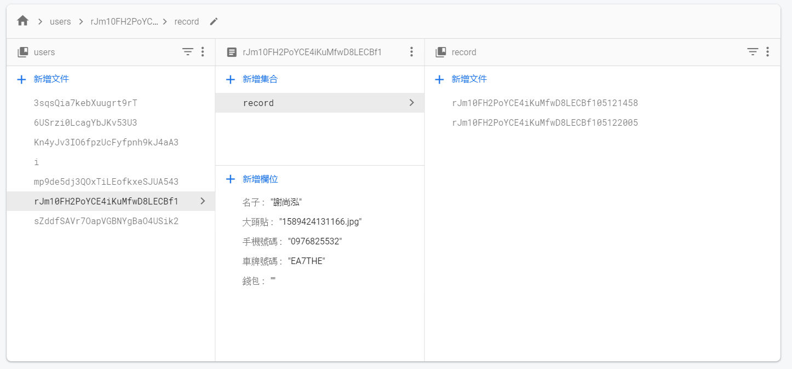

 :dart:3.尋找停車場:
---------------------------
 
(1)Google Map地圖:
 
在Google Map上，隨著手機螢幕滑動，讀取螢幕最佳中心位置附近的停車API(座標、總車位、剩餘車位、費率、是否營業中、今日營業時間、地址、電話...等等)，
顯示標記(Marker)於地圖上(特約停車場icon與一般停車場icon不同)。使用者也可以透過語音或文字搜尋地點，方便找尋停車場，也可以導航至停車場。

 
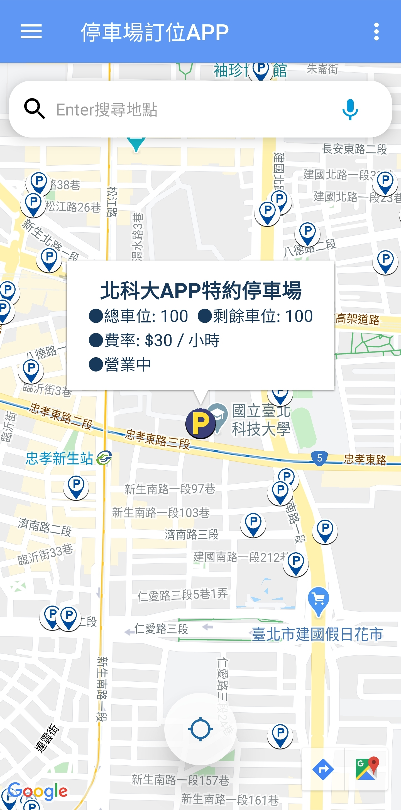

 
(2)點擊marker icon的infowindow，顯示停車場詳細資訊:
 
顯示停車場詳細資訊，下方按鈕方別有預約按鈕、街景按鈕、最愛按鈕、返回鍵按鈕。
 
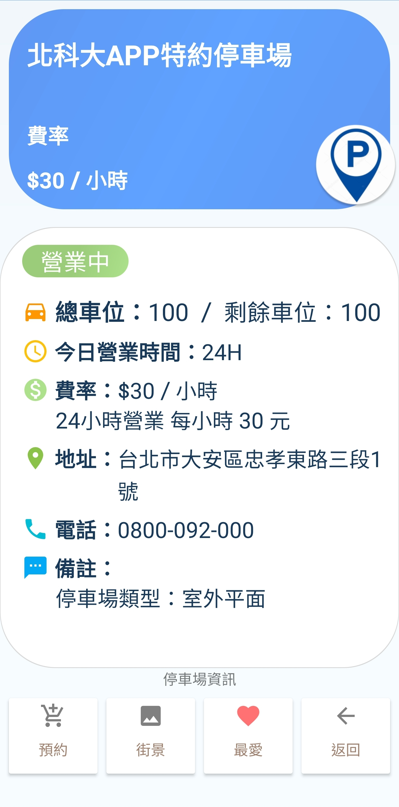

 
(3)點擊預約按鈕，進入預約介面:
 
Step1 個人資料填寫: (從firebase使用者個人檔案抓取資料下來)，並且選擇欲預約的時間
 
Step2 付款資訊:
 
資料填寫完畢後，按下預約按鈕，即將上方詳細資料上傳至Firebase(停車場管理、個人預約紀錄)
 
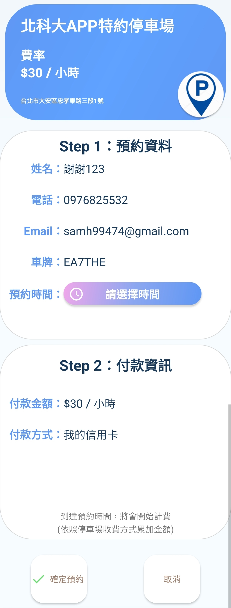
 
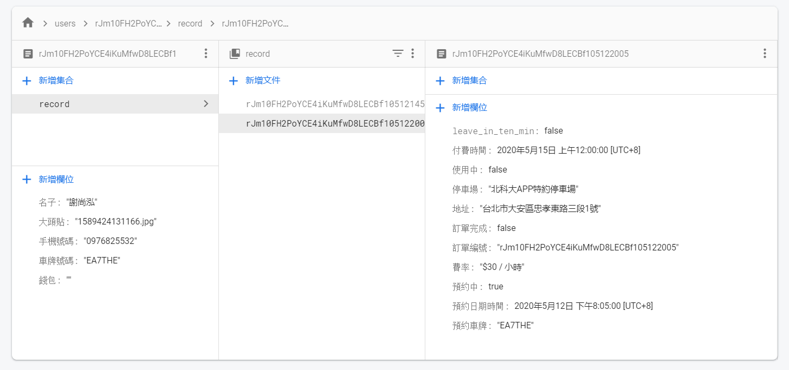
 
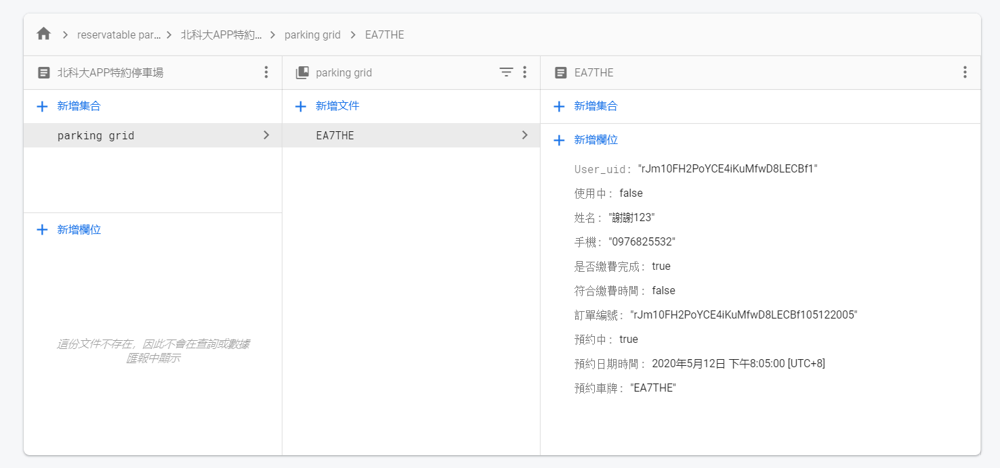

 :dart:4.預約紀錄:
---------------------------
 
抓取FireBase資料下來，以ListView Adapter形式顯示，顯示歷史預約紀錄，若要結束預約付費，可從預約紀錄裡結束預約並付費。
 
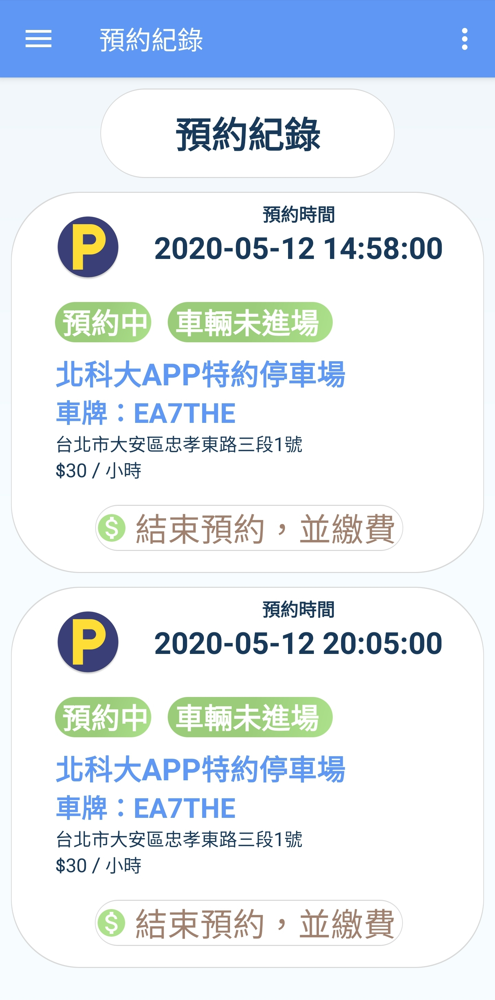

 :dart:5.我的最愛:
---------------------------
 
我的最愛功能，使用SQL本地儲存資料，以ListView Adapter形式顯示，點擊即可立即畫面移動於GoogleMap地圖上。
 
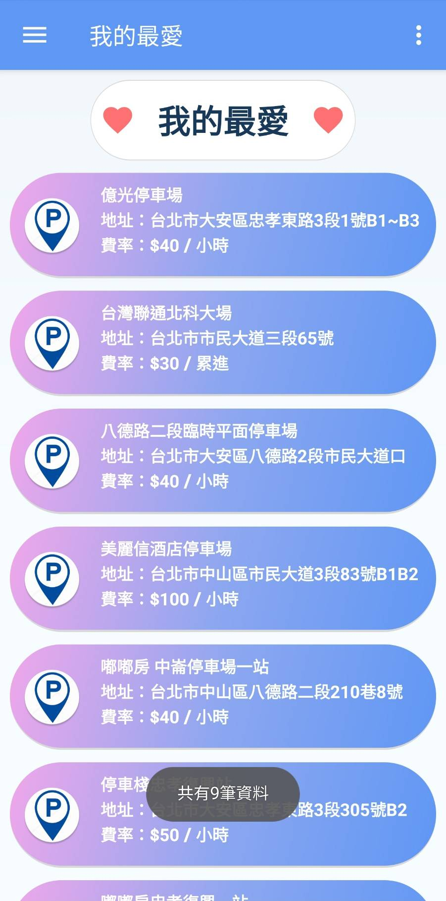

 :dart:6.智慧停車場預約系統APP 系統執行流程圖:
---------------------------
 
專題執⾏流程圖:
 
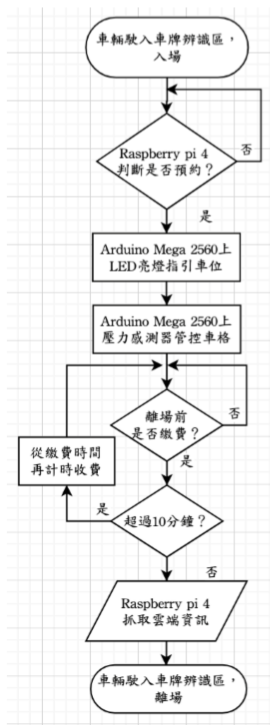
   
⼿機應用程式之主頁面流程圖:
 
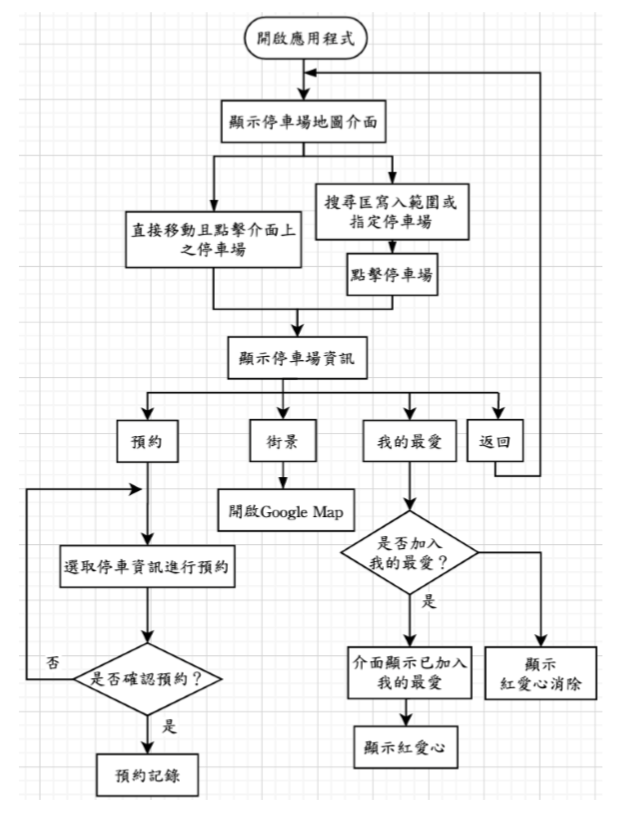
   
⼿機應用程式之側邊選單-停車相關資訊:
 
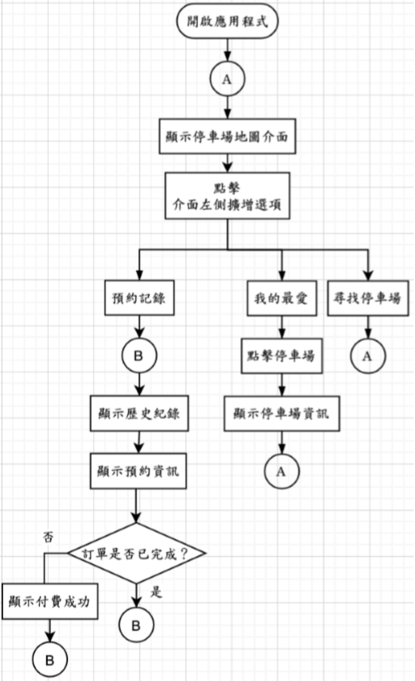
   
⼿機應用程式之側邊選單-使用者資訊:
 
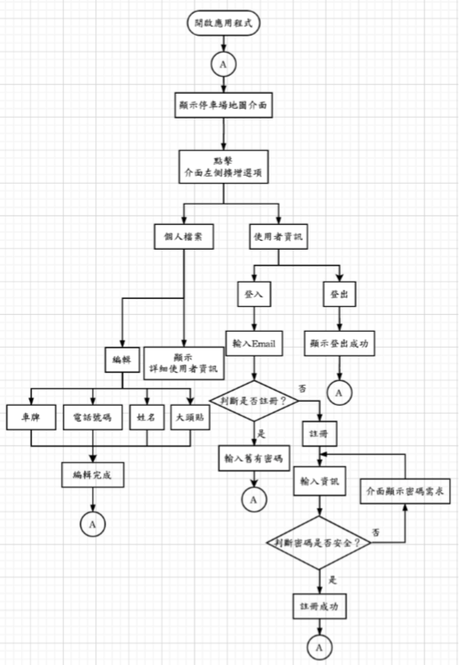
   
⼿機應用程式之側邊選單-回饋及製作團隊:
 
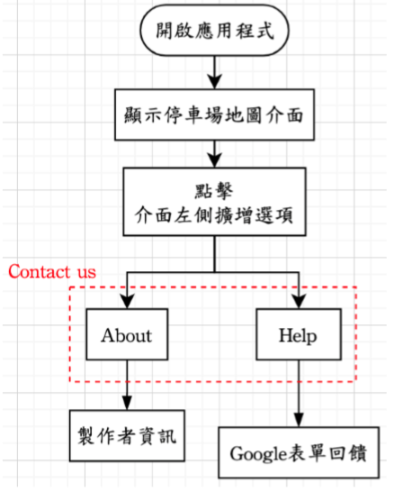

